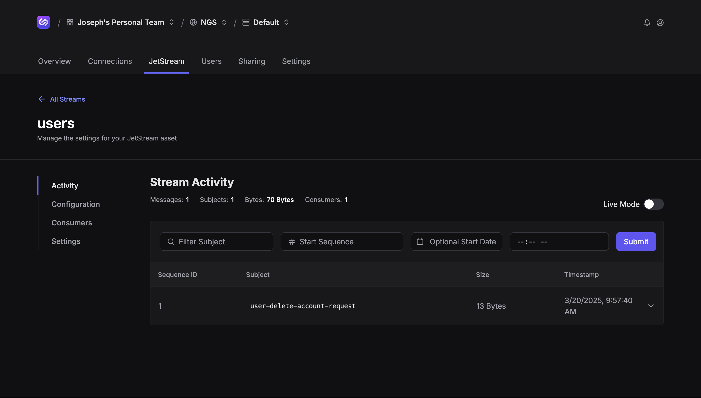

# nats.js demo

Simple demo of [nat.js](https://github.com/nats-io/nats.js/) with [Synadia Cloud / NGS](https://docs.synadia.com/cloud/faq).

To run:
```shell
npm install
node main.mjs <nats_creds_file>
```

Expected output:
```
connected: connect.ngs.global:4222
>>> hello world
<<< hello world
---
connected: jetstream
created stream: users
created durable consumer: user-consumer
>>> 1 data
<<< 1 {"user_id":1}
```

Synadia Cloud — create stream:


Docs:
- https://nats-io.github.io/nats.js/
- https://github.com/nats-io/nats.js/
- https://docs.synadia.com/cloud/faq
